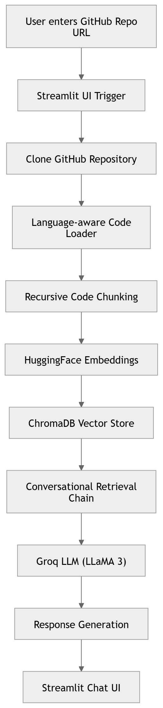

💻 GitHub Repository Q&A Chatbot (RAG System)

An AI-powered system that allows you to enter any GitHub repository URL and chat with the codebase using Retrieval-Augmented Generation (RAG).
It indexes source code into embeddings using ChromaDB and enables natural language querying via a conversational LLM.

🔮 Future Improvements:

⚡ Incremental indexing (only changed files)

🌳 AST-based parsing (Tree-sitter)

🔍 Hybrid search (BM25 + Vector)

📊 Repo analytics dashboard

🤖 Multi-agent code reviewer system

☁️ Cloud deployment (Docker + AWS)
